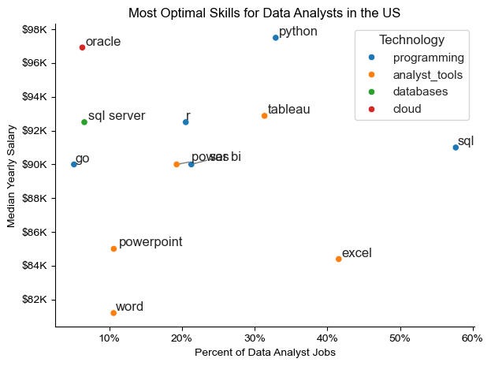

# Overview

Welcome to my analysis of the data job market, focusing on data analyst roles. This project was created out of a desire to navigate and understand the job market more effectively. It delves into the top-paying and in-demand skills to help find optimal job opportunities for data analysts.
The data, sourced from [Luke Barousse's Python Course](https://www.lukebarousse.com/python), provides a foundation for my analysis, containing detailed information on job titles, salaries, locations, and essential skills. Through a series of Python scripts, I explore key questions such as the most demanded skills, salary trends, and the intersection of demand and salary in data analytics.

# Tools I used

For my deep dive into the data analyst job market, I harnessed the power of several key tools:
- **Python**: The backbone of my analysis, allowing me to analyze the data and find critical insights. I also used the following Python libraries: 
    - **Pandas Library**: This was used to analyze the data.
    - **Matplotlib Library**: I visualized the data.
    - **Seaborn Library**: Helped me create more advanced visuals.
    - **Jupyter Notebooks**: The tool I used to run my Python scripts, which let me easily include my notes and analysis.
- **Visual Studio Code**: My go-to for executing my Python scripts.
- **Git & GitHub**: Essential for version control and sharing my Python code and analysis, ensuring collaboration and project tracking.

# Data Preparation and Cleanup

This section outlines the steps to prepare the data for analysis, ensuring accuracy and usability.

## Import & Clean Up Data

I start by importing necessary libraries and loading the dataset, followed by initial data cleaning tasks to ensure data quality.

```python
import pandas as pd
import matplotlib.pyplot as plt 
import ast 
import seaborn as sns

#Loading Data
df = pd.read_csv('/Users/robertocortez/Desktop/data_jobs.csv')

# Data Cleanup 
df['job_posted_date'] = pd.to_datetime(df['job_posted_date'])

# Converting job_skills column from str to list
df['job_skills'] = df['job_skills'].apply(
    lambda skill_list: ast.literal_eval(skill_list) if isinstance(skill_list, str) and pd.notna(skill_list) else skill_list
) 
```
## Filter US Jobs

I apply filters to the dataset to focus my analysis on the U.S. job market, narrowing it down to roles based in the United States. Often, I also filter the dataset to narrow it down to only data analyst roles.

```python

# Filtering for US jobs only
df_US = df[df['job_country'] == 'United States'].copy()


# Filtering for US Data Analyst jobs only
df_DA_US = df[(df['job_country'] == 'United States') & (df['job_title_short'] == 'Data Analyst')].copy()
```

# The Analysis

Each Jupyter notebook for this project aimed at investigating specific aspects of the data job market. Here’s how I approached each question:

## 1. What skills are most in demand for the top 3 popular data roles?

To find the most demanded skills for the top 3 most popular data roles. I filtered out those positions by which ones were the most popular and got the top 5 skills for these top 3 roles. This query highlights the most popular job titles and their top skills, showing which skills I should pay attention to depending on my target role. 

View my notebook with detailed steps here: [2_Skills_Count.ipynb](DA_project/2_Skills_Count.ipynb)

### Visualize Data

```python
fig, ax = plt.subplots(len(job_titles), 1)
sns.set_theme(style='ticks')

for i, job_title in enumerate(job_titles):
    df_plot = df_skill_perc[df_skill_perc['job_title_short'] == job_title].head(5)
    bar_plot = sns.barplot(data=df_plot, x='skill_percent', y='job_skills', ax=ax[i], hue='skill_count', palette='dark:b_r')
    ax[i].set_title(job_title)
    ax[i].set_ylabel('')
    ax[i].set_xlabel('')
    ax[i].get_legend().remove()
    ax[i].set_xlim(0, 80)
    
    # Add value labels on each bar
    for n, v in enumerate(df_plot['skill_percent']):
        ax[i].text(v + 1, n, f'{v:.1f}%', va='center')
    
    if i != len(job_titles) - 1:
        ax[i].set_xticks([])


fig.suptitle('Likelihood of Skills Requested in US Job Postings', fontsize=16)
plt.tight_layout()
plt.show()

```

### Results


### Insights

- Python is a versatile skill that is highly demanded across all three roles, but it is most prominent among data scientists (72%) and data engineers (68%).

- SQL is the most requested skill for data analysts and data engineers, and it is used in over half the job postings for data analysts and over 68% for data engineers. Python is the most sought-after skill for data scientists, appearing in 72% of job postings.

- Data Engineers require the most specialized technical skills (AWS, Azure, Spark) compared to Data Analysts and Data Scientists, who are expected to be proficient in more general data management and analysis tools (Excel, Tableau).


## 2. How are in-demand skills trending for Data Analysts?

To find how skills are trending in 2023 for Data Analysts, I filtered data analyst positions and grouped the skills by the month of the job postings. This got me the top 5 skills of data analysts by month, showing how popular skills were throughout 2023.

View my notebook with detailed steps here: [3_Skills_Trend.ipynb](DA_project/3_Skills_Trend.ipynb)


```python
# Plotting the top 5 skills for Data Analysts in the US over time
df_plot = df_DA_US_percent.iloc[:, :5]

sns.lineplot(data=df_plot, dashes=False, palette='Dark2')
sns.set_theme(style='whitegrid') 
sns.despine()

plt.title('Trending Top Skills for Data Analysts in the US')
plt.ylabel('Likelihood in Job Posting')
plt.xlabel('2023')
plt.legend().remove()

# Adding percentage to y-axis
from matplotlib.ticker import PercentFormatter
ax= plt.gca()
ax.yaxis.set_major_formatter(PercentFormatter(decimals = 0))

# Adding labels to the end of the lines
for i in range(5):
    plt.text(11.2, df_plot.iloc[-1, i], df_plot.columns[i], fontsize=14)

plt.show()
```

### Results 


*Bar graph visualizing the trending top skills for data analysts in the US in 2023*

### Insights

- SQL remains the most consistently demanded skill throughout the year, although it shows a gradual decrease in demand.
- Excel experienced a significant increase in demand starting around September, surpassing both Python and Tableau by the end of the year.
Python and Tableau show relatively stable demand throughout the year with some fluctuations but remain essential skills for data analysts. 
- Power BI, while less in demand than the others, shows a slight upward trend towards the year's end.

## 3. How well do jobs and skills pay for Data Analysts?

To identify the highest-paying roles and skills, I only got jobs in the United States and looked at their median salary. But first, I looked at the salary distributions of typical data jobs like Data Scientist, Data Engineer, and Data Analyst to understand which jobs are paid the most.

View my notebook with detailed steps here: [4_Salary_Analysis](DA_project/4_Salary_Analysis.ipynb)
### Visualize Data 

```python
# Plotting the salary distributions for the top 6 data job titles in the US
sns.boxplot(data=df_US_top6, x='salary_year_avg', y='job_title_short', order=job_order)

plt.title('Salary Distributions in the US')
plt.xlabel('Yearly Salary ($USD)')
plt.ylabel('')

# Formatting the x-axis to include $K
ax = plt.gca()
ax.xaxis.set_major_formatter(plt.FuncFormatter(lambda x, pos: f'${int(x/1000)}K'))
plt.xlim(0,600000)
plt.show()
```
### Results


*Box plot visualizing the salary distributions for the top 6 data job titles*

### Insights

- There's a significant variation in salary ranges across different job titles. Senior Data Scientist positions tend to have the highest salary potential, with up to $600K, indicating the high value placed on advanced data skills and experience in the industry.
- Senior Data Engineer and Senior Data Scientist roles show many outliers on the higher end of the salary spectrum, suggesting that exceptional skills or circumstances can lead to high pay in these roles. In contrast, Data Analyst roles demonstrate more consistency in salary, with fewer outliers.
- The median salaries increase with the seniority and specialization of the roles. Senior roles (Senior Data Scientist, Senior Data Engineer) not only have higher median salaries but also more considerable differences in typical salaries, reflecting more significant variance in compensation as responsibilities increase.


## 4. What is the most optimal skill to learn for Data Analysts?

To identify the most optimal skills to learn ( the ones that are the highest paid and highest in demand) I calculated the percent of skill demand and the median salary of these skills. To easily identify which are the most optimal skills to learn.

View my notebook with detailed steps here: [5_Optimal_Skills](DA_project/5_Optimal_Skills.ipynb)

### Visualize Data
```python
# Using technology_dict to color the scatter plot
sns.scatterplot(
    data=df_DA_skills_tech_high_demand,
    x='skill_percent',
    y='median_salary',
    hue='technology'
)

sns.despine()
sns.set_theme(style='ticks')

# Prepare texts for adjustText
texts = []
for i, txt in enumerate(df_DA_skills_high_demand.index):
    texts.append(plt.text(df_DA_skills_high_demand['skill_percent'].iloc[i], df_DA_skills_high_demand['median_salary'].iloc[i], txt))

# Adjust text to avoid overlap
adjust_text(texts, arrowprops=dict(arrowstyle='->', color='gray'))

# Set axis labels, title, and legend
plt.xlabel('Percent of Data Analyst Jobs')
plt.ylabel('Median Yearly Salary')
plt.title('Most Optimal Skills for Data Analysts in the US')
plt.legend(title='Technology')

from matplotlib.ticker import PercentFormatter
ax = plt.gca()
ax.yaxis.set_major_formatter(plt.FuncFormatter(lambda y, pos: f'${int(y/1000)}K'))
ax.xaxis.set_major_formatter(PercentFormatter(decimals=0))

# Adjust layout and display plot 
plt.tight_layout()
plt.show()
```



*A scatter plot visualizing the most optimal skills (high paying & high demand) for data analysts in the US*

### Insights:
- The scatter plot shows that most of the `programming` skills (colored blue) tend to cluster at higher salary levels compared to other categories, indicating that programming expertise might offer more significant salary benefits within the data analytics field.
- The `database` skills (colored green), such as Oracle and SQL Server, are associated with some of the highest salaries among data analyst tools. This indicates a significant demand and valuation for industry data management and manipulation expertise.
- `Analyst` tools (colored orange), including Tableau and Power BI, are prevalent in job postings and offer competitive salaries, showing that visualization and data analysis software are crucial for current data roles. This category has good salaries and is versatile across different types of data tasks.