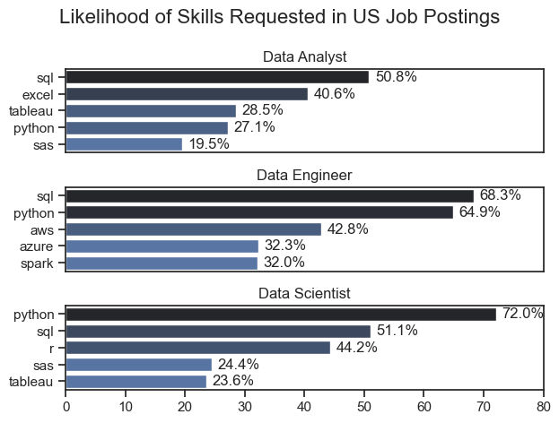
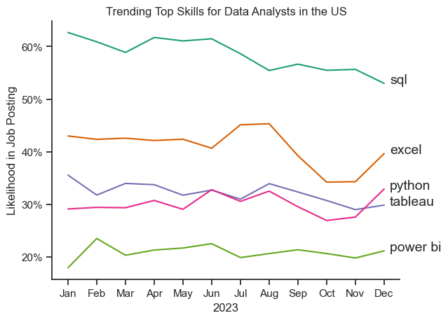
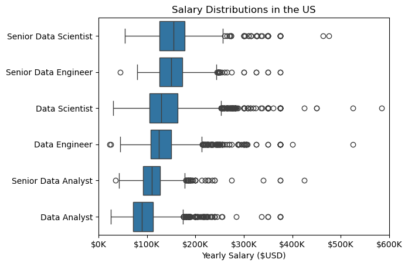

# The Analysis

## 1. What skills are most in demand for the top 3 popular data roles?

To find the most demanded skills for the top 3 most popular data roles. I filtered out those positions by which ones were the most popular and got the top 5 skills for these top 3 roles. This query highlights the most popular job titles and their top skills, showing which skills I should pay attention to depending on my target role. 

View my notebook with detailed steps here: [2_Skills_Count.ipynb](DA_project/2_Skills_Count.ipynb)

### Visualize Data

```python
fig, ax = plt.subplots(len(job_titles), 1)
sns.set_theme(style='ticks')

for i, job_title in enumerate(job_titles):
    df_plot = df_skill_perc[df_skill_perc['job_title_short'] == job_title].head(5)
    bar_plot = sns.barplot(data=df_plot, x='skill_percent', y='job_skills', ax=ax[i], hue='skill_count', palette='dark:b_r')
    ax[i].set_title(job_title)
    ax[i].set_ylabel('')
    ax[i].set_xlabel('')
    ax[i].get_legend().remove()
    ax[i].set_xlim(0, 80)
    
    # Add value labels on each bar
    for n, v in enumerate(df_plot['skill_percent']):
        ax[i].text(v + 1, n, f'{v:.1f}%', va='center')
    
    if i != len(job_titles) - 1:
        ax[i].set_xticks([])


fig.suptitle('Likelihood of Skills Requested in US Job Postings', fontsize=16)
plt.tight_layout()
plt.show()

```

### Results



### Insights

- Python is a versatile skill that is highly demanded across all three roles, but it is most prominent among data scientists (72%) and data engineers (68%).

- SQL is the most requested skill for data analysts and data engineers, and it is used in over half the job postings for data analysts and over 68% for data engineers. Python is the most sought-after skill for data scientists, appearing in 72% of job postings.

- Data Engineers require the most specialized technical skills (AWS, Azure, Spark) compared to Data Analysts and Data Scientists, who are expected to be proficient in more general data management and analysis tools (Excel, Tableau).


## 2. How are in-demand skills trending for Data Analysts?

To find how skills are trending in 2023 for Data Analysts, I filtered data analyst positions and grouped the skills by the month of the job postings. This got me the top 5 skills of data analysts by month, showing how popular skills were throughout 2023.

View my notebook with detailed steps here: [3_Skills_Trend.ipynb](DA_project/3_Skills_Trend.ipynb)


```python
# Plotting the top 5 skills for Data Analysts in the US over time
df_plot = df_DA_US_percent.iloc[:, :5]

sns.lineplot(data=df_plot, dashes=False, palette='Dark2')
sns.set_theme(style='whitegrid') 
sns.despine()

plt.title('Trending Top Skills for Data Analysts in the US')
plt.ylabel('Likelihood in Job Posting')
plt.xlabel('2023')
plt.legend().remove()

# Adding percentage to y-axis
from matplotlib.ticker import PercentFormatter
ax= plt.gca()
ax.yaxis.set_major_formatter(PercentFormatter(decimals = 0))

# Adding labels to the end of the lines
for i in range(5):
    plt.text(11.2, df_plot.iloc[-1, i], df_plot.columns[i], fontsize=14)

plt.show()
```

### Results 


*Bar graph visualizing the trending top skills for data analysts in the US in 2023*

### Insights

- SQL remains the most consistently demanded skill throughout the year, although it shows a gradual decrease in demand.
- Excel experienced a significant increase in demand starting around September, surpassing both Python and Tableau by the end of the year.
Python and Tableau show relatively stable demand throughout the year with some fluctuations but remain essential skills for data analysts. 
- Power BI, while less in demand than the others, shows a slight upward trend towards the year's end.

## 3. How well do jobs and skills pay for Data Analysts?

To identify the highest-paying roles and skills, I only got jobs in the United States and looked at their median salary. But first, I looked at the salary distributions of typical data jobs like Data Scientist, Data Engineer, and Data Analyst to understand which jobs are paid the most.

View my notebook with detailed steps here: [4_Salary_Analysis](4_Salary_Analysis.ipynb)
### Visualize Data 

```python
# Plotting the salary distributions for the top 6 data job titles in the US
sns.boxplot(data=df_US_top6, x='salary_year_avg', y='job_title_short', order=job_order)

plt.title('Salary Distributions in the US')
plt.xlabel('Yearly Salary ($USD)')
plt.ylabel('')

# Formatting the x-axis to include $K
ax = plt.gca()
ax.xaxis.set_major_formatter(plt.FuncFormatter(lambda x, pos: f'${int(x/1000)}K'))
plt.xlim(0,600000)
plt.show()
```
### Results

*Box plot visualizing the salary distributions for the top 6 data job titles*

### Insights

- There's a significant variation in salary ranges across different job titles. Senior Data Scientist positions tend to have the highest salary potential, with up to $600K, indicating the high value placed on advanced data skills and experience in the industry.
- Senior Data Engineer and Senior Data Scientist roles show many outliers on the higher end of the salary spectrum, suggesting that exceptional skills or circumstances can lead to high pay in these roles. In contrast, Data Analyst roles demonstrate more consistency in salary, with fewer outliers.
- The median salaries increase with the seniority and specialization of the roles. Senior roles (Senior Data Scientist, Senior Data Engineer) not only have higher median salaries but also more considerable differences in typical salaries, reflecting more significant variance in compensation as responsibilities increase.